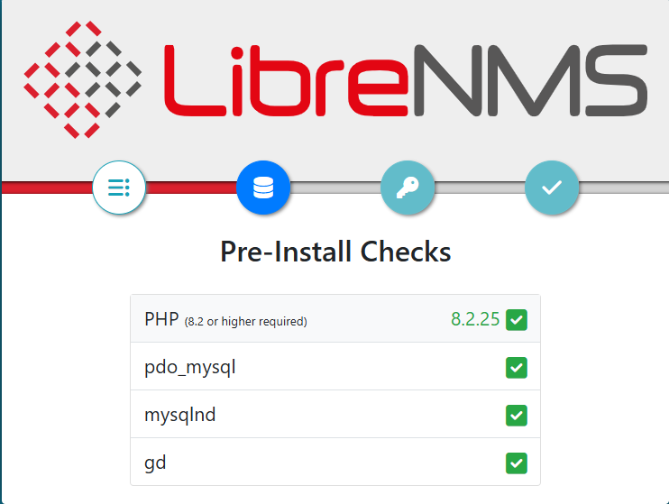

## LibreNMS:

LibreNMS is an open-source network monitoring system that provides automated network discovery, performance monitoring, and alerting. It supports a wide range of devices, including routers, switches, servers, and IoT devices, using protocols like SNMP, ICMP, and Syslog.


### Key Features:
- Automatic Network Discovery – Uses SNMP, ARP, CDP, LLDP, OSPF, and BGP to discover devices.
- Multi-Tenancy – Supports multiple users with different permission levels.
- Customizable Alerts – Integrated alerting system with email, Slack, Discord, Telegram, etc.
- Performance Graphing – Tracks CPU, memory, bandwidth, and more with RRDTool.
- API Support – RESTful API for automation and integrations.
- Distributed Polling – Scales monitoring across multiple locations.
- Integration with Tools – Works with Oxidized (configuration backup), RANCID, and Grafana.
- IPv6 and VRF Support – Monitors dual-stack networks.


### Prerequisites:

- Set Timezone for check `timedatectl`
- Disabling SELinux


## Install Required Packages:

Note: Minimum supported PHP version is 8.2


```
dnf install epel-release -y
```


### Install PHP: 


```
dnf install -y dnf-utils http://rpms.remirepo.net/enterprise/remi-release-8.rpm
```


```
dnf module list php
dnf module reset php

dnf module enable php:8.2

dnf module enable php:remi-8.2
```


```
dnf install -y bash-completion cronie fping gcc git ImageMagick mtr net-snmp net-snmp-utils nmap php-cli php-common php-curl php-gd php-gmp php-json php-mbstring php-process php-snmp php-xml php-zip php-mysqlnd python3 python3-devel python3-PyMySQL python3-redis python3-memcached python3-pip python3-systemd rrdtool unzip policycoreutils-devel 
```


```
php -v
```


#### Set timezone: 

```
vim /etc/php.ini

memory_limit = 512M
date.timezone = Asia/Dhaka
```


### Install and Configure MariaDB:

```
dnf install -y mariadb-server mariadb
```


```
vim /etc/my.cnf.d/mariadb-server.cnf


[mysqld]

innodb_file_per_table=1
lower_case_table_names=0

```


```
systemctl start mariadb
systemctl enable mariadb
systemctl status mariadb
```


```
mysql -u root
```


```
CREATE DATABASE librenms CHARACTER SET utf8mb4 COLLATE utf8mb4_unicode_ci;

CREATE USER 'librenms'@'localhost' IDENTIFIED BY 'password';

GRANT ALL PRIVILEGES ON librenms.* TO 'librenms'@'localhost';
```


### Create LibreNMS User:

```
useradd librenms -d /opt/librenms -M -r -s "$(which bash)"
```


### Download LibreNMS:

```
cd /opt

git clone https://github.com/librenms/librenms.git
```


```
chown -R librenms:librenms /opt/librenms
chmod 771 /opt/librenms
```


#### Install PHP dependencies: 

```
su - librenms
```


```
cd /opt/librenms

./scripts/composer_wrapper.php install --no-dev

exit
```


### Install Apache: 

```
dnf install -y httpd php-fpm 
```


#### Configure PHP-FPM:

```
cp /etc/php-fpm.d/www.conf /etc/php-fpm.d/librenms.conf
```


Change `[www]` to `[librenms]` and Change user and group `apache` to `librenms`:

```
vim /etc/php-fpm.d/librenms.conf


[librenms]

user = librenms
group = librenms

;listen = /run/php-fpm/www.sock
listen = /run/php-fpm-librenms.sock

```


```
systemctl start httpd
systemctl start php-fpm

systemctl status httpd
systemctl status php-fpm
```


#### Configure Web Server:

```
vim /etc/httpd/conf.d/librenms.conf


<VirtualHost *:80>
  DocumentRoot /opt/librenms/html/
  ServerName  librenms.example.com

  AllowEncodedSlashes NoDecode
  <Directory "/opt/librenms/html/">
    Require all granted
    AllowOverride All
    Options FollowSymLinks MultiViews
  </Directory>

  # Enable http authorization headers
  <IfModule setenvif_module>
    SetEnvIfNoCase ^Authorization$ "(.+)" HTTP_AUTHORIZATION=$1
  </IfModule>

  <FilesMatch ".+\.php$">
    SetHandler "proxy:unix:/run/php-fpm-librenms.sock|fcgi://localhost"
  </FilesMatch>
</VirtualHost>

```


```
systemctl restart httpd
systemctl restart php-fpm

systemctl status httpd
systemctl status php-fpm
```


```
httpd -t
```


### Cron job:

```
cp /opt/librenms/dist/librenms.cron /etc/cron.d/librenms
```


### Configure snmpd:

_Copy and configure SNMP configuration template:_

```
cd /etc/snmp
mv snmpd.conf snmpd.conf.bak

cp /opt/librenms/snmpd.conf.example /etc/snmp/snmpd.conf
```


_Edit the text which says `RANDOMSTRINGGOESHERE` and set your own community string:_

```
vim /etc/snmp/snmpd.conf


# Change RANDOMSTRINGGOESHERE to your preferred SNMP community string
#com2sec readonly  default         RANDOMSTRINGGOESHERE
com2sec readonly  default        public

group MyROGroup v2c        readonly
view all    included  .1                               80
access MyROGroup ""      any       noauth    exact  all    none   none

syslocation Rack, Room, Building, City, Country [Lat, Lon]
syscontact Your Name <your@email.address>

#OS Distribution Detection
extend distro /usr/bin/distro

#Hardware Detection
# (uncomment for x86 platforms)
#extend manufacturer '/bin/cat /sys/devices/virtual/dmi/id/sys_vendor'
#extend hardware '/bin/cat /sys/devices/virtual/dmi/id/product_name'
#extend serial '/bin/cat /sys/devices/virtual/dmi/id/product_serial'

# (uncomment for ARM platforms)
#extend hardware '/bin/cat /sys/firmware/devicetree/base/model'
#extend serial '/bin/cat /sys/firmware/devicetree/base/serial-number'
```


_Download distribution version identifier script:_

```
curl -o /usr/bin/distro https://raw.githubusercontent.com/librenms/librenms-agent/master/snmp/distro

chmod +x /usr/bin/distro
```


```
systemctl enable snmpd
systemctl restart snmpd
```


### Enable the scheduler:

```
cp /opt/librenms/dist/librenms-scheduler.service /opt/librenms/dist/librenms-scheduler.timer /etc/systemd/system/

systemctl enable librenms-scheduler.timer
systemctl start librenms-scheduler.timer
```


### Enable `lnms` command completion: 

```
ln -s /opt/librenms/lnms /usr/bin/lnms

cp /opt/librenms/misc/lnms-completion.bash /etc/bash_completion.d/
```


### logrotate config:

LibreNMS keeps logs in `/opt/librenms/logs`. Over time these can become large and be rotated out. To rotate out the old logs you can use the provided logrotate config file:

```
cp /opt/librenms/misc/librenms.logrotate /etc/logrotate.d/librenms
```


### Allow Fping:

Create the file `http_fping.tt` with the following contents. You can create this file anywhere, as it is a throw-away file. The last step in this install procedure will install the module in the proper location.

```
vim /opt/librenms/http_fping.tt


module http_fping 1.0;

require {
type httpd_t;
class capability net_raw;
class rawip_socket { getopt create setopt write read };
}

#============= httpd_t ==============
allow httpd_t self:capability net_raw;
allow httpd_t self:rawip_socket { getopt create setopt write read };
```


```
chown -R librenms:librenms /opt/librenms/http_fping.tt
```


Then run these commands:

```
checkmodule -M -m -o http_fping.mod http_fping.tt
checkmodule -M -m -o http_fping.mod /opt/librenms/http_fping.tt
```


```
semodule_package -o http_fping.pp -m http_fping.mod
semodule -i http_fping.pp
```


```
systemctl restart httpd
```


### Access LibreNMS:

Now, open your browser and go to: `http://your_server_IP`





### Adjust Fping6: 

Go back to command line terminal and perform the following to validate the installation.

```
vim /opt/librenms/config.php


### Add this line for Fping6:
$config['fping6'] = '/usr/sbin/fping';
```


```
chown -R librenms:librenms /opt/librenms
```


### Troubleshooting: 

Now, validate the installation using the following script:

```
su - librenms

/opt/librenms/validate.php
```


```
tail -f /opt/librenms/logs/librenms.log
```


### Verify the Device is Added: 

```
sudo -u librenms /opt/librenms/lnms list
```


```
sudo -u librenms /opt/librenms/lnms --version

  LibreNMS 25.1.0
```


_Check if the device is being polled:_

```
sudo -u librenms /opt/librenms/poller.php -h 192.168.10.192 -d

or,

sudo -u librenms /opt/librenms/lnms device:poll 192.168.10.192
```


_If it doesn’t appear, try rediscovery:_

```
sudo -u librenms /opt/librenms/discovery.php -h 192.168.10.192 -d

or,

sudo -u librenms /opt/librenms/lnms poller:discovery 192.168.10.192
```


_LibreNMS uses RRD (Round Robin Database) files for graphing:_

```
rrdtool info /opt/librenms/rrd/192.168.10.192/uptime.rrd
```


---
---


## Add Hosts in the LibreNMS:


### Step-1: Configure SNMP:

```
dnf install -y net-snmp net-snmp-utils net-snmp-libs 
```


```
vim /etc/snmp/snmpd.conf


# System contact information

# It is also possible to set the sysContact and sysLocation system
# variables through the snmpd.conf file:

syslocation DC-Dhaka 
syscontact Me <me@example.com> 

agentAddress udp:161,udp6:[::1]:161

#rocommunity public default
rocommunity public 127.0.0.1
rocommunity public 192.168.10.0/24
```


_Check from localhost:_

```
snmpwalk -v 2c -c public localhost
```


_Check from LibreNMS server:_

```
snmpwalk -v 2c -c public 192.168.10.192
```


### Step-2: Add the Device via Web UI:

1. Log in to LibreNMS Web UI → `Devices` → `+ Add Device`:
  - `Hostname or IP`: 192.168.10.192
  - `SNMP`: ON
  - `SNMP Version`: `v2c` | Port: `161` | `udp`
  - `Port Association Mode`: 
  - `Community`: public 
  - Click `Add Device`.


### Links:
- [Install LibreNMS](https://docs.librenms.org/Installation/Install-LibreNMS/)
- [Install LibreNMS on CentOS 8](https://computingforgeeks.com/how-to-install-librenms-on-rhel-centos-8/)
- [To Install and Configure LibreNMS](https://support3155.rssing.com/chan-34036048/all_p42.html)

